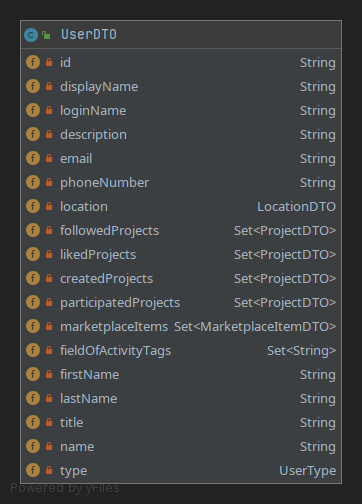
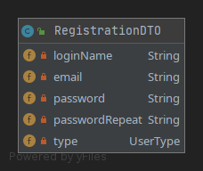
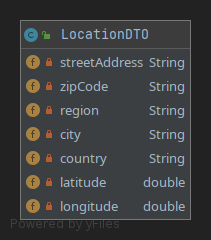
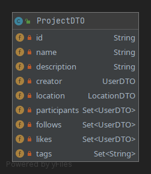
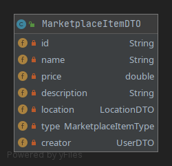
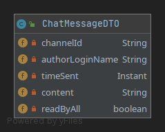
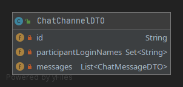

# DSS-protoype

## Login
### REST-API :
- **Authenticate**:             GET `api/login/authenticate` (returns true if valid login)
- **Get own user object**:      GET `api/login/user` (only works if logged in)
## Users
### Attributes:

Notes: 
- `type` can be one of the following strings for the frontend: `PERSON`,`COMPANY`,`INSTITUTION` 
- `followedProjects`, `likedProjects`, `participatedProjects`, `marketPlaceItems` should not be sent by frontend, but will be returned with get-type methods
- Location attributes can (but don't have to) be set by frontend, apart from latitude and longitude. Backend will usually succeed to fetch some coordinates, even with an incomplete location object, like no zipcode, no country, or badly formatted street adress, etc.
- `displayName` and `fieldOfActivityTags` are new and common to all types of users and can be set by frontend

### REST-API :

- **Create**:                   POST `api/users/registerUser`
- **Get all**:                  GET `api/users/getAllUsers`
- **Get**:                      GET `api/users/getUser?id={id}` || `api/users/getUser?loginName={loginName}` || `api/users/getUser?email={email}`
- **Update**:                   POST `api/users/updateUser`(user-id required!)
- **Delete**:                   DELETE `api/users/deleteUser?id={id}` || `api/users/deleteUser?loginName={loginName}` || `api/users/deleteUser?email={email}`
- **Like Project**:             GET `api/users/likeProject?id={id}`
- **Unlike Project**:           GET `api/users/unlikeProject?id={id}`
- **Follow Project**:           GET `api/users/followProject?id={id}`
- **Unfollow Project**:         GET `api/users/unfollowProject?id={id}`
## Projects
### Attributes:

Notes: 
- `type` can be one of the following strings for the frontend: `PERSON`,`COMPANY`,`INSTITUTION` 
- `creator`, `participants`, `follows`, `likes` should not be sent by frontend, but will be returned with get-type methods (some of these are manipulated by frontend over other REST-paths)
- Location attributes can (but don't have to) be set by frontend, apart from latitude and longitude. Backend will usually succeed to fetch some coordinates, even with an incomplete location object, like no zipcode, no country, or badly formatted street adress, etc.
- `tags` can be set by frontend

### REST-API :
- **Create**                    POST `api/projects/createProject`
- **Get all**:                  GET `api/projects/getAllProjects`
- **Get**:                      GET `api/projects/getProject?id={id}` || `api/projects/getProject?name={name}`
- **Update**:                   POST `api/projects/updateProject` (project-id required!)
- **Delete**:                   DELETE `api/projects/deleteProject?id={id}` || `api/projects/deleteProject?name={name}`

## Marketplace
### Attributes:

Notes: 
- `type` can be one of the following strings for the frontend: `OFFER`,`REQUEST`
- `creator` should not be sent by frontend, but will be returned with get-type methods
- Location attributes can (but don't have to) be set by frontend, apart from latitude and longitude. Backend will usually succeed to fetch some coordinates, even with an incomplete location object, like no zipcode, no country, or badly formatted street adress, etc.

### REST-API :
- **Create**                   POST `api/marketplace/createItem`
- **Get all**:                  GET `api/marketplace/getAllItems` || `api/marketplace/getAllOffers` || `api/marketplace/getAllRequests`
- **Get**:                      GET `api/marketplace/getProject?id={id}`
- **Update**:                   POST `api/marketplace/updateItem` (item-id required!)
- **Delete**:                   DELETE `api/marketplace/deleteItem?id={id}`

## Chat

### Attributes:

### WEBSOCKET-API (STOMP)
- **Subscribing to messages**      `/topic/chat.{channel_id}` (expect same attributes in message objects as in the ChatMessageDTO)
- **Sending messages**              `app/chat/chat.{channel_id}` (only the message content needs to be sent, everything else is added by the server)

### REST-API :
- **Establish Chat-Channel**    POST `api/chat/establishChannel`(only need to post participants list, if logged in user is missing he will be automatically added on server-side)
- **Get my Chat-Channels**:     GET `api/chat/getMyChannels` (should be sorted by last message timestamp, not sure if ascending or descending :P)

## Tags
### Attributes:
name : String

### REST-API :
- **Get all tags (field of activity + project tags)**    GET `api/tags/getAll` (just returns a List of strings)
- **Create tag**:     GET `api/tags/create?name={name}` (not sure if there is any use for this, since tags are created automatically from project/user updates)
- **Delete tag**:     DELETE `api/tags/delete?name={name}` (also not sure if there is any use for this)

## Project Setup
1. Import project using the pom.xml in parent directory. In IntelliJ: File -> New -> Project from Existing Sources -> choose pom.xml
2. Go to Project Settings (Ctrl+Shift+Alt+S) and make sure that "Project SDK" is a Java 14 SDK (in IntelliJ you can autodownload OpenJDK 14) and "Project Langauge level" is set to 14, too
3. Create a Maven run configuration (Run -> Edit Configurations -> Click on the plus and choose Maven). Then set the Working directory to the DSS-prototype main directory and put the following into "command line": <code>spring-boot:run</code> (if you want debug info <code>spring-boot:run -X</code>)
4. Run the configuration, it will build angular, copy it in the resources folder of the backend and run the Spring Boot backend, which sets up a Tomcat server accessible with <code>localhost:8080/</code> by default
### Additional Info:
- If you only want to change things in the backend you don't have to let it rebuild Angular everytime (takes a while), so instead, you can use the Spring Boot run configuration that should be created automatically on project import (at least in IntelliJ)
- If there's any problem with dependencies that are not available, or the Maven run configuration fails for some reason, I recommend adding another Maven run configuration and running it: Put the project root folder as "Working directory" and in the "Command line"-field, put: <code>clean install -X</code>

## Useful Links
- Tutorial for how to do Spring Security with Angular https://spring.io/guides/tutorials/spring-security-and-angular-js/